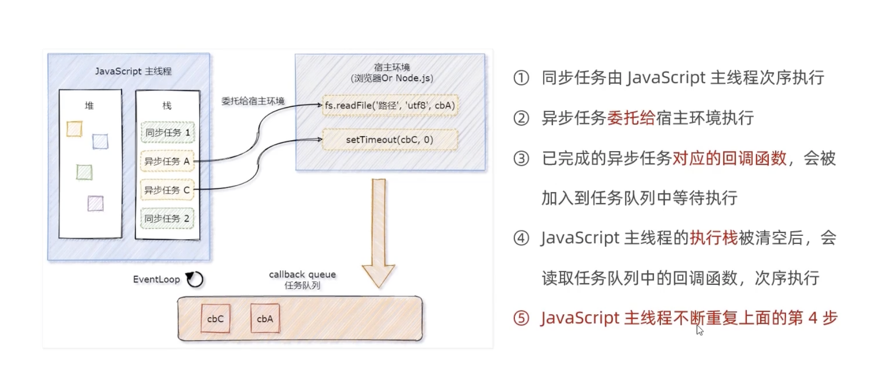
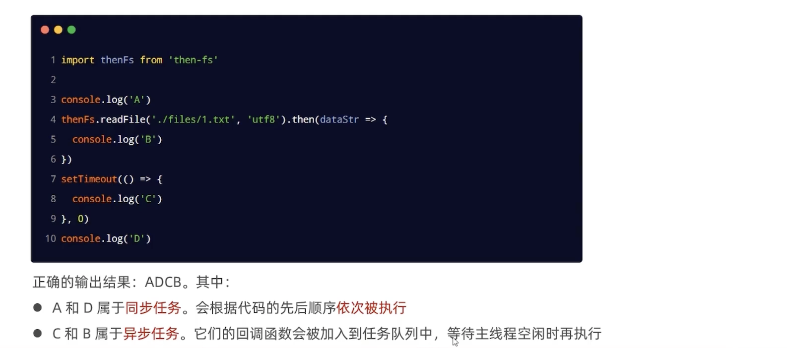
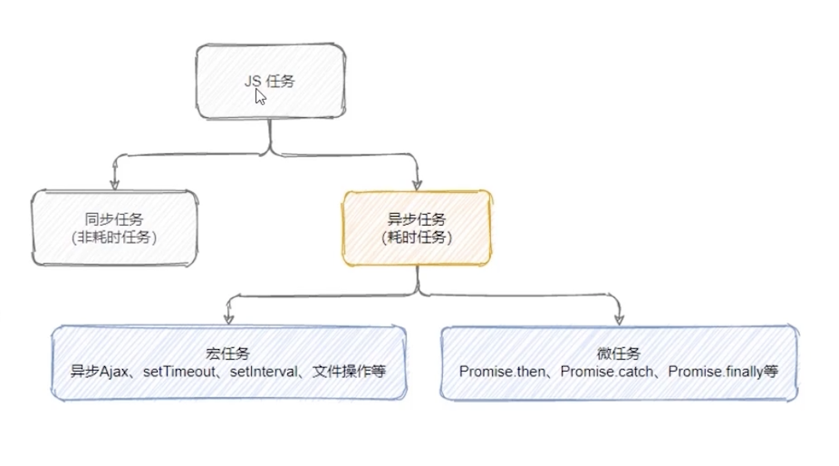
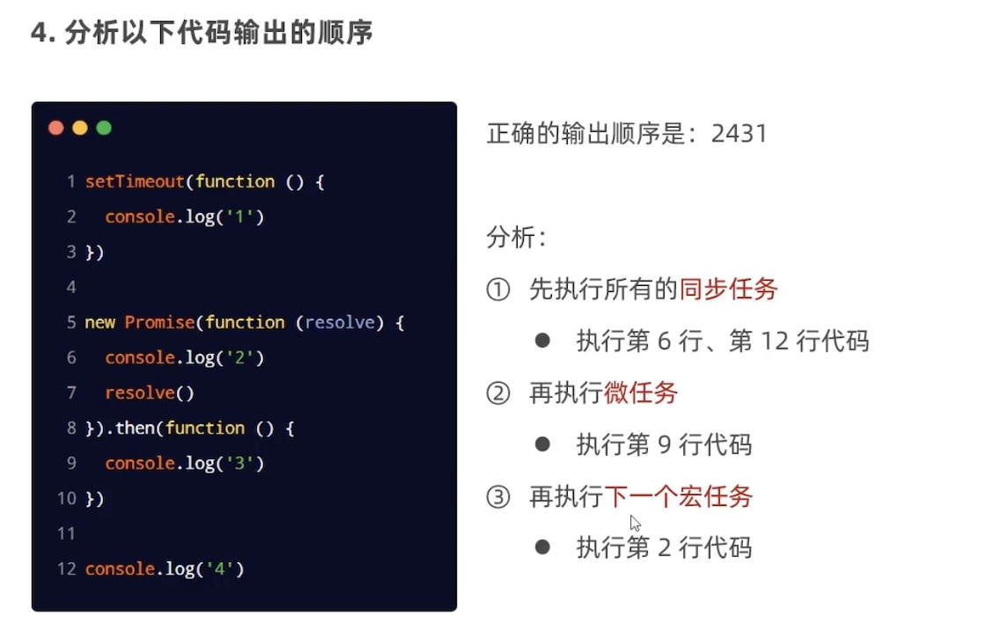
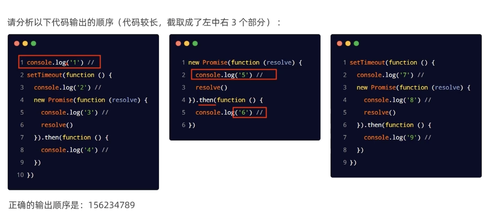

### EventLoop
JavaScript是**单线程执行**的语言，也就是说，同一时间只能做一件事。存在的问题: 如果**前一个任务非常耗时**，则后续的任务就必须得一直等待，从而导致**程序假死**问题。  
  
为了防止某个**耗时任务**导致**程序假死**的问题，JavaScript把待执行的任务分为了两类：
- **同步任务**
  - 又叫做**非耗时任务**，指的是在主线程上排队执行的那些任务
  - 只有前一个任务执行完毕，后一个任务才会执行
- **异步任务**
  - 又叫做**耗时任务**，异步任务由JavaScript**委托**给**宿主环境**进行执行
  - 当异步任务执行完成后，会通知**JavaScript主线程**执行异步任务的**回调函数**

**同步过程和异步任务的执行过程**：
  

**JavaScript主线程从任务队列中读取异步任务的回调函数，放到执行栈中依次执行**，这个过程循环不断，所以整个运行机制称为`EventLoop`(时间循环)

### 宏任务/微任务
JavaScript又把异步任务做了进一步划分。分为：
- 宏任务
  - 异步Ajax请求
  - `setTimeout`、`setInterval`
  - 文件操作
  - 其他宏任务
- 微任务
  - `Promise.then`、`.catch` 和 `.finally`
  - `process.nextTick`
  - 其他微任务

**任务分类**：  
  

**宏任务和微任务的执行顺序**：  
  
每执行一个宏任务之后就会检查**是否存在待执行的微任务**，如果有则执行所有微任务，如果没有则执行下一个宏任务  

**经典面试题**：
  

  
