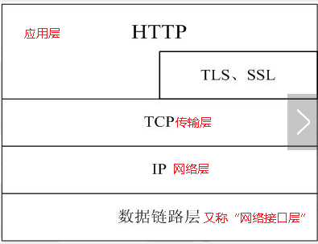

## Web技术基础
## <a name="index">Contents</a>
- [Internet 与 Web技术](#IW)
- [Web技术的主要组成](#WebT)  

### <a name="IW">Internet 与 Web技术</a>
- [Internet介绍](#Internet)  
- [Web介绍](#Web)  
- [Web技术特点](#Feature)  

#### <a name="Internet">Internet介绍</a>
<b>Internet</b>常被称作<b>互联网</b> , 可以追溯到1962年，美国国防部设计的一种分散的指挥系统：由一个个分散点指挥点组成，当一个被摧毁后，其他点仍能正常工作。1969年，美国国防部建立了一个 [ARPANET](https://zh.wikipedia.org/wiki/ARPANET)(阿帕网) 的网络，这个阿帕网就是 Internet 最早的雏形。  
  
到1972年时，ARPANET 网上的网点数已到达40多个，网点间彼此可以发送小文本文件(即现在的 [E-mail](https://zh.wikipedia.org/wiki/%E7%94%B5%E5%AD%90%E9%82%AE%E4%BB%B6))，和利用[文件传输协议](https://zh.wikipedia.org/wiki/%E6%96%87%E4%BB%B6%E4%BC%A0%E8%BE%93%E5%8D%8F%E8%AE%AE)发送大文本文件和数据文件(即现在的 [FTP](https://zh.wikipedia.org/wiki/%E6%96%87%E4%BB%B6%E4%BC%A0%E8%BE%93%E5%8D%8F%E8%AE%AE))。同时也发现了通过一台计算机模拟成另一台远程计算机的一个终端而使用                                                                            远程计算机上的资源的方法(即 [Telent](https://zh.wikipedia.org/wiki/Telnet))。 E-mail、FTP 和 Telnet 是 Internet 上较早出现的重要应用，特别是 E-mail 任然是目前 Internet 上最主要的应用之一。  
  
1974年，[TCP/IP](https://zh.wikipedia.org/wiki/TCP/IP%E5%8D%8F%E8%AE%AE%E6%97%8F) 协议问世。这个协议定义了一种在计算机网络间传送报文(文件或命令)的方法。 TCP/IP 协议核心技术的公开最终导致了 Internet 的大发展，TCP/IP 协议以其跨平台特性为全球信息化时代的到来架起了桥梁。  
  
1980年，世界上既有使用 TCP/IP 协议的 ARPANET, 也有使用其他通信协议的网络。为了将这些网络连接起来，TCP/IP 协议和互联网架构的联合设计者之一的文顿·瑟夫提出一个方法：在网络内部各自使用自己的[通信协议](https://zh.wikipedia.org/wiki/%E7%BD%91%E7%BB%9C%E4%BC%A0%E8%BE%93%E5%8D%8F%E8%AE%AE)，在和其他网络通信时使用 TCP/IP 协议。这个设想最终导致了 Internet 的诞生，并确立了 TCP/IP 协议在网络互联方面不可动摇的地位。  
  
1993年以后，通过互联网所看到的不再是文字，开始有了图片、声音和动画，网路内容日益丰富，从而形成了目前使用的 Internet。  

#### <a name="Web">Web介绍</a>
WWW(World Wide Web)常被称为[万维网](https://zh.wikipedia.org/wiki/%E4%B8%87%E7%BB%B4%E7%BD%91)，简称为Web。 Web是互联网上的一种应用服务，它使用[超文本技术](https://zh.wikipedia.org/wiki/%E8%B6%85%E6%96%87%E6%9C%AC)将遍布全球的各种信息资源链接起来，以便于用户访问。Web上的信息资源格式多样，资源彼此通过超链接连接起来，在逻辑上形成了一个遍布全球的巨大的“信息网络” ———— Web名称由此而来。  
  
在Web系统里，每个有用的信息对象称为一个“资源”，并且用一个全局的统一资源标识符 [URL](https://zh.wikipedia.org/wiki/%E7%BB%9F%E4%B8%80%E8%B5%84%E6%BA%90%E5%AE%9A%E4%BD%8D%E7%AC%A6) (Uniform Resource Identifier) 进行标识。 这些资源通过超文本传输协议 [HTTP](https://zh.wikipedia.org/wiki/%E8%B6%85%E6%96%87%E6%9C%AC%E4%BC%A0%E8%BE%93%E5%8D%8F%E8%AE%AE) (Hypertext Transfer Protocol)传送给用户，用户通过单击链接获取资源。目前 Web 技术由[万维网联盟](https://zh.wikipedia.org/wiki/%E4%B8%87%E7%BB%B4%E7%BD%91%E8%81%94%E7%9B%9F)(World Wide Web Consoritum，简称 W3C， 又称 W3C 理事会)来维护和管理。  
  
<b>互联网时 Web 技术的基础平台，Web 是互联网平台的一种[应用层](https://zh.wikipedia.org/wiki/%E5%BA%94%E7%94%A8%E5%B1%82)服务。</b>
除Web外，FTP 、QQ 、E-mail等也是互联网上其他类型的应用层服务。  

#### <a name="Feature">Web 技术特点
<ol>
    <li>Web 页面具有丰富的多媒体表现特性</li>
    <li>Web 具备超级链接和快速导航能力</li>
    <li>Web 具有平台独立性</li>
    <li>Web 具有分布自治特性</li>
    <li>Web 具有动态交互特性</li>
</ol>
### <a name="WebT">Web技术的主要组成</a>
- [Internet IP 地址与网络域名](#InternetI)  
- [统一资源定位符 URL](#URL)  
- [HTTP 协议](#HTTP)  
- [HTML 语言](#HTMLLan)  
  
#### <a name="InternetI">Internet IP 地址与网络域名
在以 TCP/IP 网络协议为主的网络中，机器之间的访问是通过 [IP](https://zh.wikipedia.org/wiki/%E7%BD%91%E9%99%85%E5%8D%8F%E8%AE%AE) 地址来进行的。 所谓 IP 地址就是给每个连接在 Internet 上的主机分配的一个32位的地址。 IP 地址使用二进制来表示，每个IP地址长32位，即4个字节。 为了方便使用，IP 地址经常被写成十进制的形式，中间使用符号 “.” 分开不同的字节。 这种表示法叫作 “[点分十进制表示法](https://zh.wikipedia.org/wiki/%E7%82%B9%E5%88%86%E5%8D%81%E8%BF%9B%E5%88%B6)”。  
  
由于 IP 地址是数字标识，使用时难以记忆，因此在 IP 地址的基础上又发展出一种符号化的地址表示方案，来代替数值型的 IP 地址。 这个与网络上的数字型 IP 地址相对的字符型地址，就被称为[域名](https://zh.wikipedia.org/wiki/%E5%9F%9F%E5%90%8D)(Domain Name), 域名系统由 DNS (Nomain Name Server)服务器来管理和解析。  
  
通常，一个 IP 地址对应一个 DNS 域名。 但在实际应用中，一个 IP 地址可以对应多个域名，例如[虚拟主机](https://zh.wikipedia.org/wiki/%E8%99%9A%E6%8B%9F%E4%B8%BB%E6%9C%BA)；反之，一个域名也可以对应多个 IP 地址。  
  
#### <a name="URL">统一资源定位符 URL
统一资源定位符 URL (Uniform Resource Locator), 也叫Web网址，俗称“网址”。  
  
基本格式为：  
```
<访问协议>://<主机名>:<端口号>/<文件路径>
```

常见的访问方式有HTTP、FTP等，端口号、文件路径有时候可以省略，除了以上部分外，完整的 URL 中在`<文件路径>`的后部还可以包含`? <查询字符串>#<文档内片段标识>`，其中`<查询字符串>`用来标识查询参数，而`<文档内片段标识>`用来标识在一个文档内部进行链接跳转时的跳转位置。  
#### <a name="HTTP">HTTP 协议
[HTTP](https://zh.wikipedia.org/wiki/%E8%B6%85%E6%96%87%E6%9C%AC%E4%BC%A0%E8%BE%93%E5%8D%8F%E8%AE%AE) 是 Hypertext Transfer Protocol(超文本传输协议) 的缩写，是一种客户端和服务器请求和应答的标准 (TCP), 用于从 WWW 服务器传输超文本到本地浏览器的传输协议，它可以使浏览器更加高效，使网络传输减少。HTTP 是万维网的数据通信的基础，设计HTTP最初的目的是为了提供一种发布和接收 HTML 页面的方法。  
  

https: 是以安全为目标的HTTP通道，简单讲是HTTP的安全版，即HTTP下加入[SSL](https://zh.wikipedia.org/wiki/%E4%BC%A0%E8%BE%93%E5%B1%82%E5%AE%89%E5%85%A8%E6%80%A7%E5%8D%8F%E8%AE%AE)(Secure Sockets Layer)层，HTTPS的安全基础是SSL，因此加密的详细内容就需要SSL。  
  
https协议的主要作用是：建立一个信息安全通道，来确保数组的传输，确保网站的真实性。  
  
**http和https的区别？**  
  
http传输的数据都是未加密的，也就是明文的，网景公司设置了SSL协议来对http协议传输的数据进行加密处理，简单来说https协议是由http和ssl协议构建的可进行加密传输和身份认证的网络协议，比http协议的安全性更高。  
主要的区别如下：  
  
Https协议需要ca证书，费用较高。  
  
http是超文本传输协议，信息是明文传输，https则是具有安全性的ssl加密传输协议。  
  
使用不同的链接方式，端口也不同，一般而言，http协议的端口为80，https的端口为443  
  
http的连接很简单，是无状态的；HTTPS协议是由SSL+HTTP协议构建的可进行加密传输、身份认证的网络协议，比http协议安全。  
  
**https协议的工作原理**  
  
客户端在使用HTTPS方式与Web服务器通信时有以下几个步骤，如图所示。  
  
客户使用https url访问服务器，则要求web 服务器建立ssl链接。  
  
web服务器接收到客户端的请求之后，会将网站的证书（证书中包含了公钥），返回或者说传输给客户端。  
  
客户端和web服务器端开始协商SSL链接的安全等级，也就是加密等级。  
  
客户端浏览器通过双方协商一致的安全等级，建立会话密钥，然后通过网站的公钥来加密会话密钥，并传送给网站。  
  
web服务器通过自己的私钥解密出会话密钥。  
  
web服务器通过会话密钥加密与客户端之间的通信。  
  
**https协议的优点**  
  
使用HTTPS协议可认证用户和服务器，确保数据发送到正确的客户机和服务器；  
  
HTTPS协议是由SSL+HTTP协议构建的可进行加密传输、身份认证的网络协议，要比http协议安全，可防止数据在传输过程中不被窃取、改变，确保数据的完整性。  
  
HTTPS是现行架构下最安全的解决方案，虽然不是绝对安全，但它大幅增加了中间人攻击的成本。  
  
谷歌曾在2014年8月份调整搜索引擎算法，并称“比起同等HTTP网站，采用HTTPS加密的网站在搜索结果中的排名将会更高”。  
  
**https协议的缺点**  
  
https握手阶段比较费时，会使页面加载时间延长50%，增加10%~20%的耗电。  
  
https缓存不如http高效，会增加数据开销。  
  
SSL证书也需要钱，功能越强大的证书费用越高。  
  
SSL证书需要绑定IP，不能再同一个ip上绑定多个域名，ipv4资源支持不了这种消耗。  
#### <a name="HTMLLan">HTML 语言

-------------

持续更新中...